# Simpleadmin for Foxconn T99W175

Static web interface (HTML/JS with Bash CGI helpers) to administer Foxconn T99W175 modem. This version is heavily inspired by the work at [iamromulan/quectel-rgmii-toolkit](https://github.com/iamromulan/quectel-rgmii-toolkit) has some heavy edits to make it work with the T99W175 and some changes that i thought would make it better for us.

## Credits and thanks
- Original project: [iamromulan](https://github.com/iamromulan) – repo: [quectel-rgmii-toolkit](https://github.com/iamromulan/quectel-rgmii-toolkit).
- The new web interface (`frontend/`) is based on [QManager](https://github.com/dr-dolomite/QManager-RM520N) by [DrDolomite](https://github.com/dr-dolomite), MIT License with the Commons Clause condition (`frontend/LICENSE`): it may be used, modified and shared, not sold.
- Core contributors for scripts, testing, and troubleshooting:
  - [1alessandro1](https://github.com/1alessandro1)
  - [stich86](https://github.com/stich86)
  - [gionag](https://github.com/gionag)


## Quick overview
- Two web front-ends on the same CGIs: the default one (Next.js static export, React + shadcn/ui, English and Italian) under `frontend/`, ported from QManager, see [Web interface](#-web-interface); and the classic Bootstrap/Alpine.js pages in `deploy/www-alpine/`, installed with `--www-alpine`.
- Bash CGI scripts in `deploy/www/cgi-bin/` that drive AT commands, the connection watchdog, TTL override, scheduled reboot and utility actions.
- Front-end settings via `deploy/www/config/simpleadmin.conf`, here you can enable or disable the login page and the esim configuration page,by default login is on , and esim is off
```
# SimpleAdmin configuration
# Set to 0 to completely disable login and allow open access.
# Set to 1 (default) to require user login.
SIMPLEADMIN_ENABLE_LOGIN=1

# Cross-site request protection: authenticated CGI calls must carry a Referer
# from the same host. Set to 0 only to drive the CGI endpoints from scripts
# that cannot send a Referer (curl users can pass -e http://<modem-ip>/).
SIMPLEADMIN_CSRF_CHECK=1

# GUI lock (maintenance mode)
# When locked, the UI redirects to SIMPLEADMIN_GUI_LOCK_PAGE and CGI endpoints
# behave as unauthenticated.
SIMPLEADMIN_GUI_LOCKED=0

# Pre-shared key required by /cgi-bin/gui_toggle?key=... (or ?k=...).
SIMPLEADMIN_GUI_TOGGLE_KEY=""

# Page shown while locked.
SIMPLEADMIN_GUI_LOCK_PAGE="/webguioff.html"

# eSIM management page (requires the intermediate euicc-client server)
# Set to 1 to show and enable the eSIM management UI, 0 to hide it.
SIMPLEADMIN_ENABLE_ESIM=0

# Base URL for the eSIM intermediate server (default: local euicc-client API)
SIMPLEADMIN_ESIM_BASE_URL="http://localhost:8080/api/v1"
```
### Security notes

- The default account is `admin` / `admin`: change its password after the first login. It is recreated only when no administrator account is left, and there is no default read-only account.
- Passwords in `deploy/www/cgi-bin/credentials.txt` are stored as SHA-512 crypt hashes (`$6$salt$hash`, the `/etc/shadow` format, via `openssl passwd -6` or busybox `cryptpw`). `./install.sh` converts any plaintext password left in the file to its hash; one that is still there (an install done by hand) works and is replaced by its hash on the next successful login.
- Accounts with the `user` role can only send read-only AT commands (queries, test commands, identification and the output-format settings the dashboard needs).
- With `SIMPLEADMIN_ENABLE_LOGIN=0` every CGI endpoint runs with administrator rights for anyone who can reach the modem; `SIMPLEADMIN_CSRF_CHECK=1` keeps other websites from driving it through the browser, but it does not replace a password.

Check [docs/Explaination.md](docs/Explaination.md) for file-by-file behavior, request flows, and how each page uses the CGI helpers.
For the dedicated Tailscale integration documentation, see [docs/Tailscale.md](docs/Tailscale.md).

## GUI lock (maintenance mode)

Goal: allow installers to open a "special link" from a browser to unlock the GUI, perform the work, then lock it again and show a static instruction page.

How it works:
- When `SIMPLEADMIN_GUI_LOCKED=1`, the frontend redirects to `SIMPLEADMIN_GUI_LOCK_PAGE` (default: `/webguioff.html`).
- Server-side, `session_load` is blocked, so all CGI endpoints that require a session behave as unauthenticated while locked.
- No extra "delay": the lock status is returned by the existing `/cgi-bin/session_status` request the UI already performs.

### Enable it
1. Set a strong key in `deploy/www/config/simpleadmin.conf`:
   - `SIMPLEADMIN_GUI_TOGGLE_KEY="use_a_long_random_string_here"`
2. Deploy files to the modem (see Installation).

### Use it (the "special link")
- Lock:
  - `/cgi-bin/gui_toggle?key=YOUR_KEY&mode=lock`
- Unlock:
  - `/cgi-bin/gui_toggle?key=YOUR_KEY&mode=unlock`
- Toggle (flips state):
  - `/cgi-bin/gui_toggle?key=YOUR_KEY&mode=toggle`

Notes:
- The key is in the URL: it can end up in browser history, screenshots, and (depending on server setup) logs. Use a long random key and only on trusted networks.
- If you lose the key, you can unlock by setting `SIMPLEADMIN_GUI_LOCKED=0` in `deploy/www/config/simpleadmin.conf` (or redeploying the stock config).

---

## 📸 Screenshots

### Default front-end (`deploy/www-nextjs`)

Identifiers (IMEI, IMSI, ICCID, cell ID, MAC and WAN addresses) are masked.

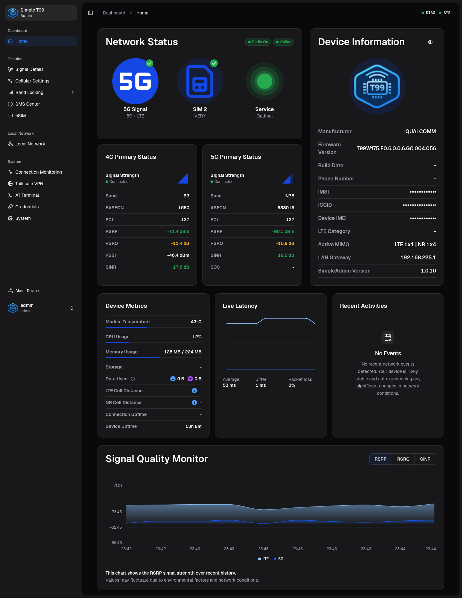

<details>
<summary><b>More screenshots</b></summary>

### Signal Details
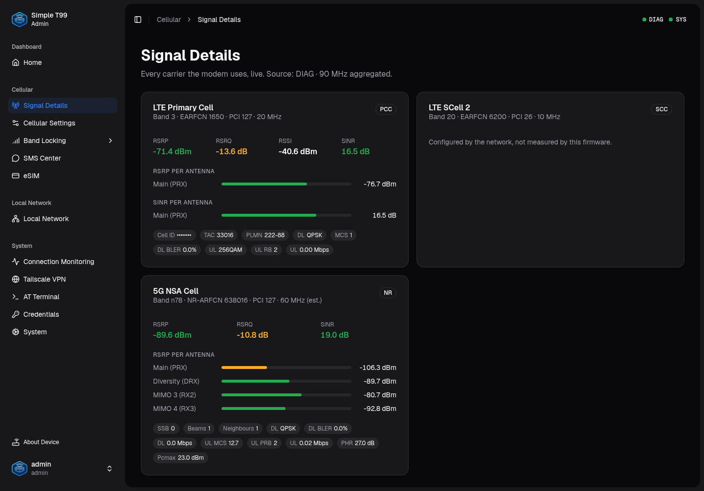

### Cellular Settings
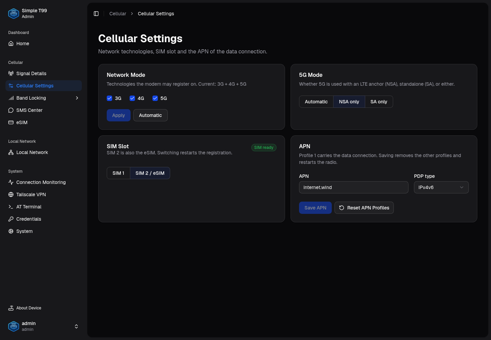

### Band Locking
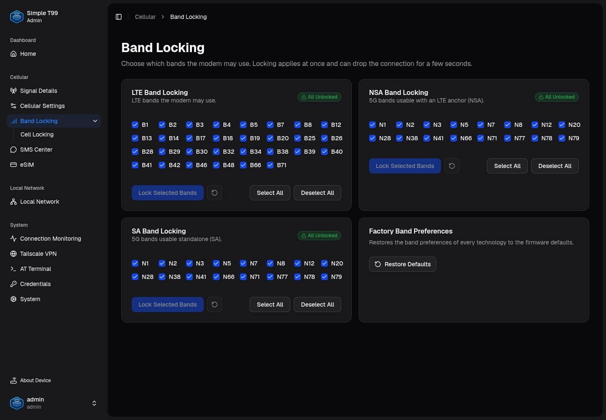

### Local Network
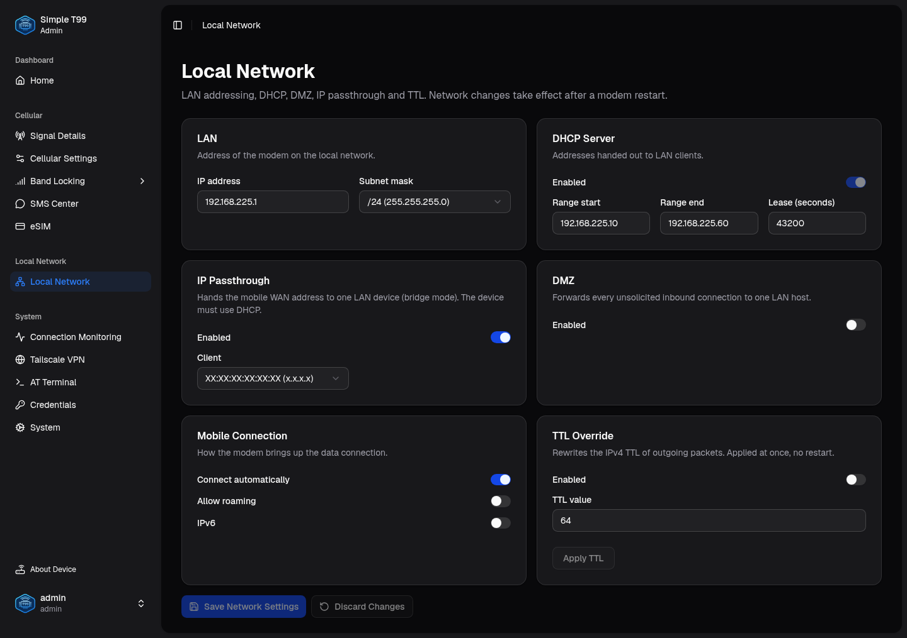

### Connection Monitoring
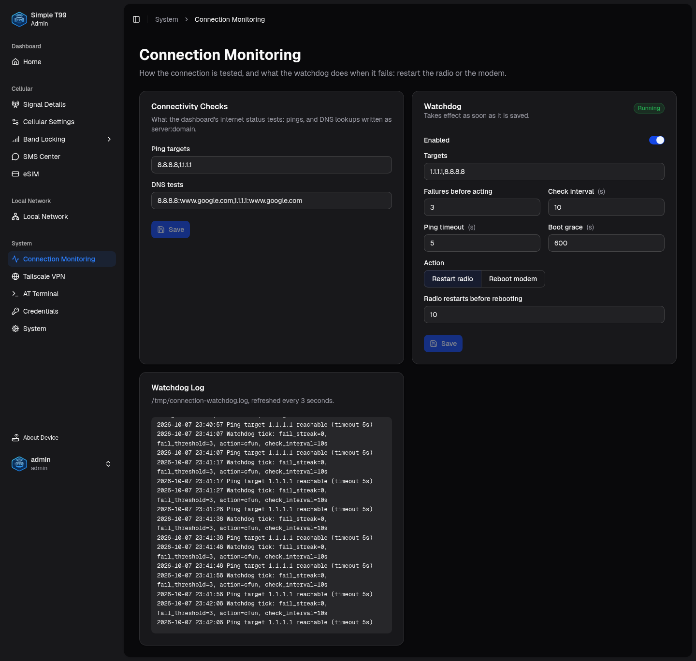

### System
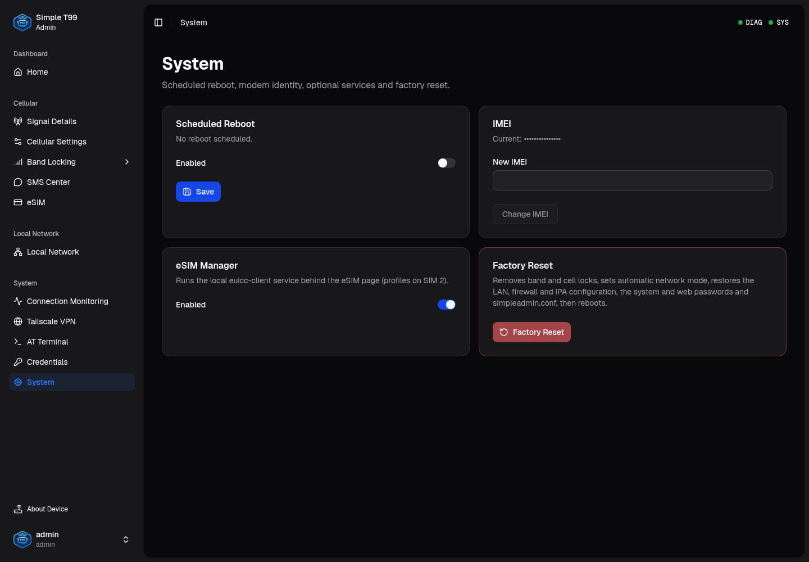

</details>

### Classic front-end (`deploy/www-alpine`, `--www-alpine`)

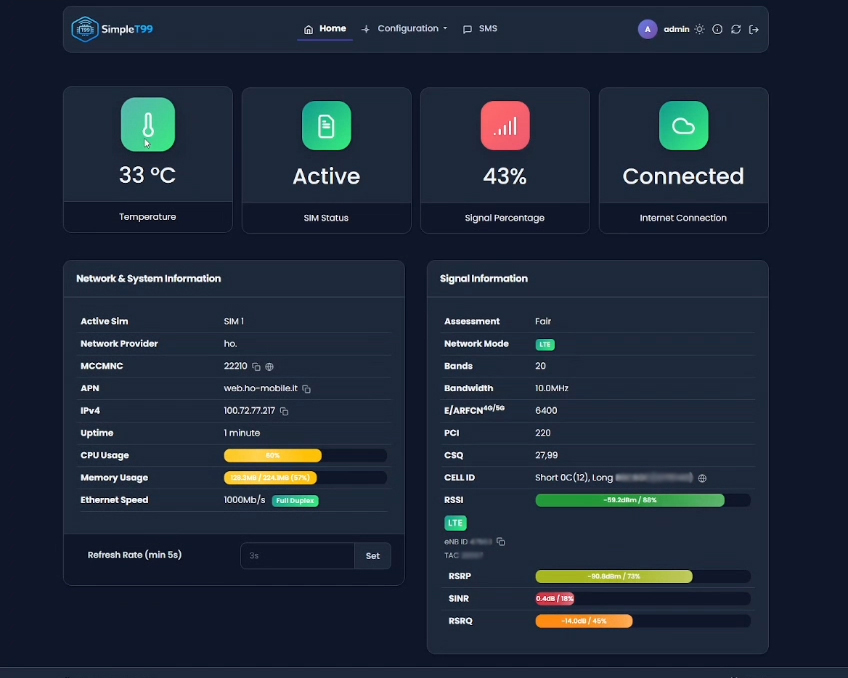

<details>
<summary><b>More screenshots</b></summary>

### Device info


### Advanced / CA
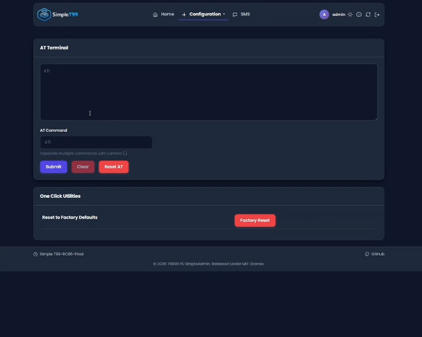
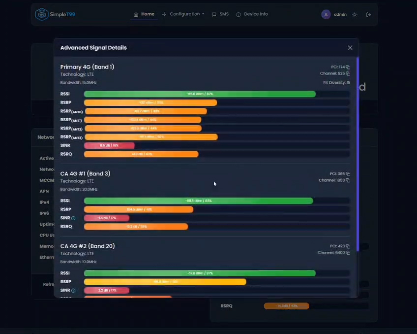

### Network


### System / User / Login

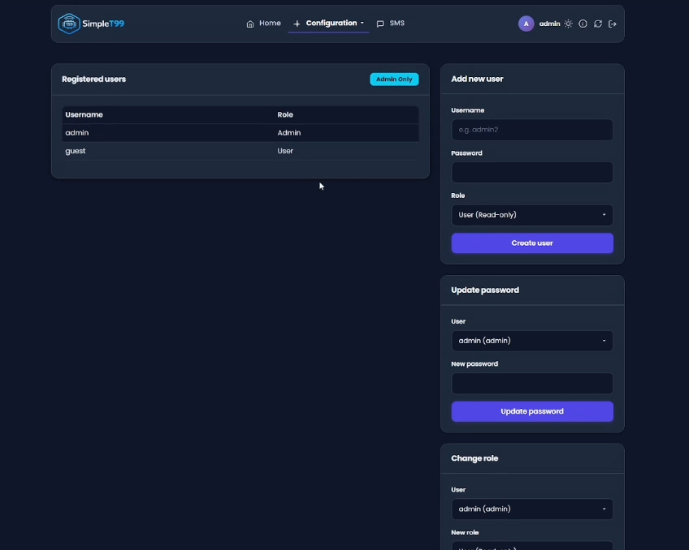
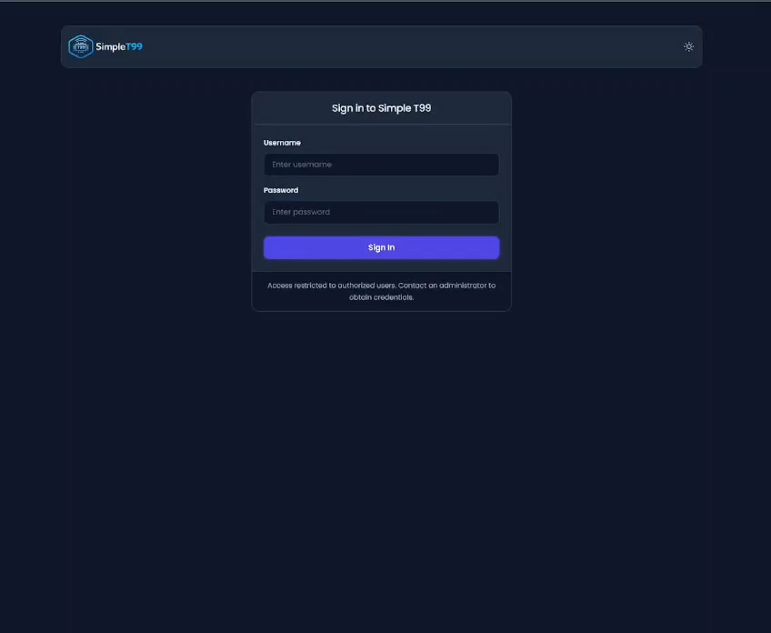

### Tools
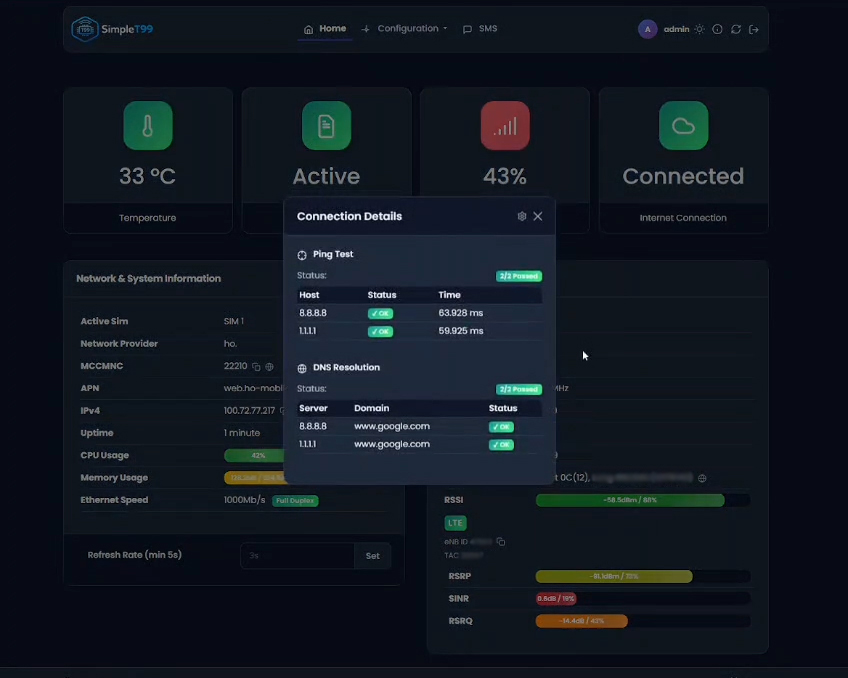
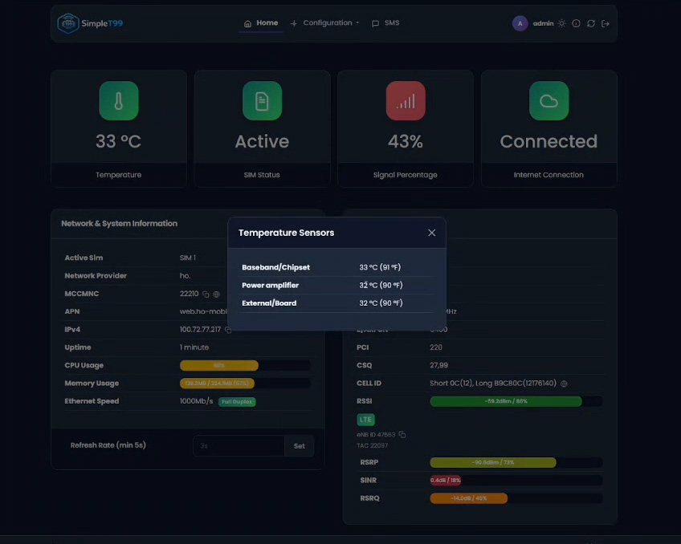
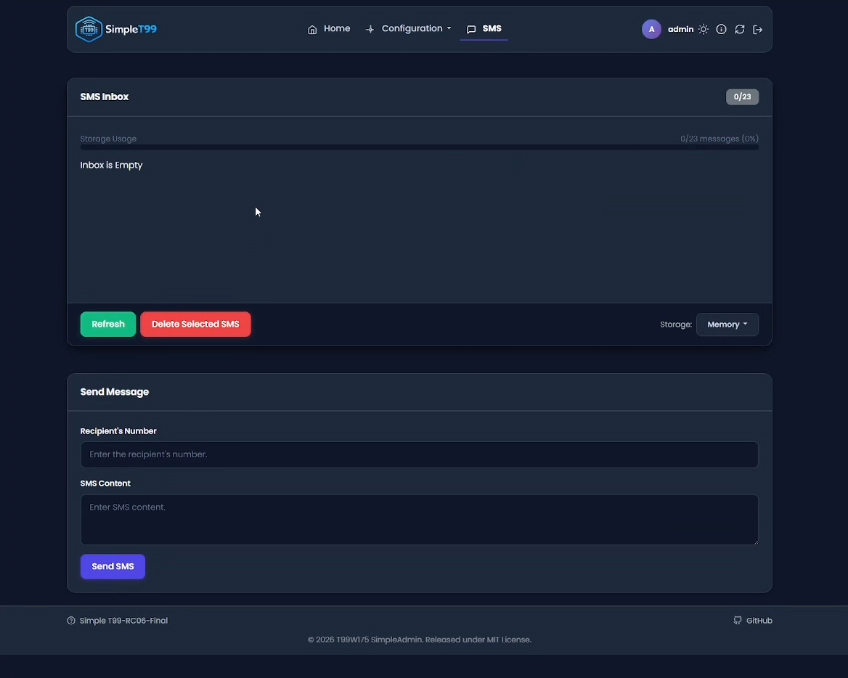

</details>

## 🛠 Installation

### Requirements

- A Foxconn T99W175 reachable from the workstation (default `192.168.225.1`)
  with SSH access as `root` by key.
- A Linux workstation with `bash`, `ssh`, `tar`, `gzip` and GNU `find`
  (the installer uses `find -printf`).
- Nothing to build: the web front-end (`deploy/www-nextjs`), `system_bridge`
  and `ra-guard` are versioned. Node.js 20+ is needed only to change the
  front-end (`frontend/build.sh`). `diag_bridge` comes from the
  `T99W175-diag-json-bridge` repository checked out next to this one
  (`deploy/diag_bridge/README.md`); without it the install goes on and the
  modem keeps the bridge it has.

### Procedure

```bash
git clone https://github.com/Brazzo978/T99W175-simpleadmin.git
cd T99W175-simpleadmin
git checkout Beta
./install.sh                 # or: ./install.sh 192.168.225.1 --nologin
```

Then open `http://192.168.225.1/`. The installer is idempotent: run it again
after every update, it only changes what differs.

| Option | Effect |
|---|---|
| `HOST` | modem address (default `192.168.225.1`) |
| `--www-nextjs` | web front-end: the new interface of `deploy/www-nextjs` (the default) |
| `--www-alpine` | web front-end: the classic Bootstrap/Alpine.js pages of `deploy/www-alpine` |
| `--onlywww` | install the web UI only (front-end, CGIs, configuration): no binaries, scripts, units or services |
| `--nologin` / `--login` | set `SIMPLEADMIN_ENABLE_LOGIN` to 0 / 1 (otherwise the current value is kept) |
| `--noesim` / `--esim` | set `SIMPLEADMIN_ENABLE_ESIM` to 0 / 1 and stop / start the euicc service, which starts only when `/home/root/euicc-sd-client` is on the modem (not with `--onlywww`) |

Examples:

```bash
./install.sh --www-alpine              # everything, classic front-end
./install.sh --onlywww                 # update the web UI only
./install.sh 10.0.0.1 --login --esim   # another address, login and eSIM on
```

Conflicting options (`--login --nologin`, `--www-alpine --www-nextjs`) stop
the installer before anything is copied.

### What `install.sh` does (workstation)

1. Reads the version from `VERSION.md` and stages `deploy/` in a temporary
   directory (only `www`, the front-ends and `install-modem.sh` with
   `--onlywww`); documentation and the Tailscale payload stay behind.
2. Builds the web root: `deploy/www` (CGIs, `config/`, GUI lock page) plus
   the chosen front-end, warns when `frontend/` is newer than its build, and
   adds a gzip copy of every text asset (busybox httpd serves it to browsers
   that accept gzip).
3. Adds `diag_bridge` (from the bridge repository), `system_bridge` and
   `ra-guard`, warning when a binary is missing or older than its sources, and checks
   that every module folder is there.
4. Identifies the target without the AT channel (hostname `sdxprairie`,
   SDX55 SoC, Foxconn `fxdiag`, `/WEBSERVER`) and refuses anything else.
5. Copies the payload to `/tmp/simpleadmin-install` on the modem, runs
   `install-modem.sh` there and removes the payload afterwards.

### What `install-modem.sh` does (modem)

In this order; each step reports `unchanged` when there is nothing to do.

1. **Leftovers of older installs**: removes `/opt/simpleadmin`,
   `/opt/scripts/diag`, the old TTL value file, a shadowing
   `diag_bridge.service` in `/etc`, hand-made `wants` links of the managed
   units, and the systemd version of the MAC fix.
2. **Web UI**: stages the new web root next to `/WEBSERVER/www`, keeps every
   `simpleadmin.conf` value already set (new keys get their default) and the
   existing `cgi-bin/credentials.txt` (plaintext passwords become SHA-512
   crypt), applies `--login`/`--esim`, then stops `qcmap_httpd`, swaps the
   tree and starts it again; on failure the previous UI is put back.
   With `--onlywww` the installer stops here.
3. **Tools in `/data/simpleadmin`**: `curl` and `jq` with their libraries
   (wrappers in `/usr/bin`, the firmware's `libcurl` untouched) and
   `modem_config` (linked from `/usr/bin` and `/usr/sbin`); each one is run
   once to check it works.
4. **System scripts and units**: `ttl-override`, `connection-watchdog` (its
   configuration `/opt/scripts/Watchdog` only the first time), the crontab
   init script, `dhcp-guard` and the systemd units in `/lib/systemd/system`.
5. **Persistent MAC**: udev rule and script for `eth0`, `/sbin/ifconfig`
   wrapper for `bridge0` (the firmware's `ifconfig` kept as
   `/sbin/ifconfig.real`); applies at the next reboot.
6. **diag_bridge, system_bridge, ra-guard**: binaries in `/data/simpleadmin/bin`,
   linked from `/usr/bin`, units enabled and restarted; a binary that does not
   run on the modem is not installed (the one already there is kept).
7. **AT client**: `/usr/bin/atcli_smd8` becomes a link to `system_bridge`,
   the serialized AT client (the firmware's is kept as
   `/usr/bin/atcli_smd8.real` and put back if the new one does not answer).
8. **Services**: `crontab`, `dhcp-guard.timer` (run once right away),
   `ttl-override` (re-applies `/persist/ttlvalue`), `connection-watchdog` and
   `euicc` enabled or disabled as their configuration says.
9. **Summary**: state of every unit and free space on `/` and `/data`.

### Manual install (web UI only)

Without the installer, build the web root by hand and copy it over; this
does not keep the modem's `simpleadmin.conf` and `credentials.txt`, and does
not install the bridges the dashboard reads.

```bash
mkdir /tmp/www && cp -R deploy/www/. deploy/www-nextjs/. /tmp/www/   # or deploy/www-alpine/.
scp -r /tmp/www root@192.168.225.1:/WEBSERVER/www.new
ssh root@192.168.225.1 'chmod -R 755 /WEBSERVER/www.new &&
  rm -rf /WEBSERVER/www && mv /WEBSERVER/www.new /WEBSERVER/www &&
  systemctl restart qcmap_httpd.service'
```

### Repository layout

Everything that ends up on the modem lives in `deploy/`, one folder per
module, each split by kind (`bin/`, `lib/`, `scripts/`, `systemd/`, ...):

```
deploy/
  install-modem.sh       modem side of install.sh
  www/                   CGIs, configuration and the GUI lock page (both front-ends)
  www-nextjs/            default front-end, built from frontend/
  www-alpine/            classic Alpine.js front-end
  diag_bridge/  system_bridge/  curl/  jq/
  ttl/  crontab/  watchdog/  euicc/  persistent-mac/  modem-config/
  dhcp-guard/            keeps stale passthrough leases out of the LAN DHCP
  ra-guard/              deprecates old IPv6 prefixes and routers on the LAN
  tailscale/             not pushed: the UI downloads it from GitHub
```

Text assets (`.html`, `.css`, `.js`, ...) are installed with a gzip copy next to
them, which busybox httpd serves to browsers that accept it (about a fifth of
the bytes).

Binaries go to `/data/simpleadmin` (persistent UBIFS `usrfs`): the root
filesystem has only a few MB free. Copies left in `/opt/simpleadmin` by older
installs are removed.

| What | Source in this repo | On the modem |
|---|---|---|
| Web UI | `deploy/www/` plus `deploy/www-nextjs/` (default) or `deploy/www-alpine/` | `/WEBSERVER/www` (`qcmap_httpd` restarted) |
| `diag_bridge`, `system_bridge` | `deploy/diag_bridge/` (`bin/diag_bridge` symlink into the bridge repository, see its `README.md`) and `deploy/system_bridge/` (`src/`, `build.sh`, `bin/system_bridge`), each with `systemd/<daemon>.service` | `/data/simpleadmin/bin/<daemon>` linked from `/usr/bin/<daemon>`, `/lib/systemd/system/<daemon>.service` (enabled) |
| `curl`, `jq` | `deploy/curl/`, `deploy/jq/` (`bin/`, `lib/`) | `/data/simpleadmin/{bin,lib}` with wrappers in `/usr/bin`; the firmware's `libcurl.so.4` is left untouched |
| System scripts | `deploy/ttl/`, `deploy/crontab/`, `deploy/watchdog/`, `deploy/euicc/` | `/opt/scripts/{ttl,watchdog}`, `/etc/init.d/crontab`, units in `/lib/systemd/system`; see `docs/Enable_New_feature.md` |
| DHCP guard | `deploy/dhcp-guard/` | `/opt/scripts/dhcp-guard/dhcp-guard`, run every minute by `dhcp-guard.timer` (see below) |
| IPv6 RA guard | `deploy/ra-guard/` (`src/`, `build.sh`, `bin/ra-guard`, `systemd/ra-guard.service`, `udev/99-bridge-no-snooping.rules`) | `/data/simpleadmin/bin/ra-guard` linked from `/usr/bin/ra-guard`, state in `/data/simpleadmin/ra-guard.state`, `ra-guard.service` (enabled), `/etc/udev/rules.d/99-bridge-no-snooping.rules` (see below) |
| `modem_config` | `deploy/modem-config/scripts/modem_config` | `/data/simpleadmin/bin/modem_config`, linked from `/usr/bin` and `/usr/sbin`: run `modem_config` from an SSH console |

## 🖥 Web interface

`frontend/` is a fork of the [QManager](https://github.com/dr-dolomite/QManager-RM520N)
frontend (upstream commit `7a7007c`), rebuilt on this project's backend:
QManager polls Quectel AT commands through a shell poller, which the T99W175
neither understands nor needs. Here the pages read the two WebSocket bridges
(below) and the existing CGIs:

- `lib/bridge/` keeps one shared socket per bridge, open only while a page
  listens and the tab is visible, and turns the diag_bridge / system_bridge
  messages into the `ModemStatus` structure the QManager components expect
  (DIAG first, QMI as completion and fallback).
- On pages with live data the header shows the two bridges (**DIAG**,
  **SYS**) with their state and the radio source; elsewhere it shows nothing.
  It only watches and never keeps the bridges connected by itself.
- Login uses the SimpleAdmin sessions (`authenticate`, `session_status`,
  `logout`). AT commands go through `get_atcommand` (read-only for non-admin
  accounts), the AT terminal through `user_atcommand`.

| Page | What | Backend |
|---|---|---|
| Dashboard | network, LTE/5G cells, device, latency, signal chart | WebSockets |
| Signal Details | every carrier, per-antenna RSRP/SINR, DL/UL details | WebSockets |
| Cellular Settings | network mode, 5G NSA/SA, SIM slot, APN | `^SLMODE`, `^NR5G_MODE`, `^SWITCH_SLOT`, `+CGDCONT` |
| Band Locking / Cell Locking | LTE, NSA, SA bands; LTE and 5G SA cell locks | `^BAND_PREF_EXT`, `^LTE_LOCK`, `^NR5G_LOCK` |
| SMS Center | inbox, send, delete | `+CMGL`, `send_sms` |
| eSIM | profiles, download (QR), notifications | euicc-client API |
| Local Network | LAN, DHCP, DMZ, IP passthrough, WAN, TTL | `network_settings`, `set_ttl` |
| Connection Monitoring | connectivity checks, watchdog, its log | `*_connection_config`, `connection_watchdog` |
| Tailscale VPN, AT Terminal, Credentials | as named | `tailscale`, `user_atcommand`, `manage_credentials` |
| System | scheduled reboot, IMEI, eSIM manager, factory reset | `reboot_schedule`, `^NV=550`, `toggle_esim`, `factory_reset` |

Build it with Node.js 20+:

```bash
frontend/build.sh            # npm ci on first run, next build, copy to deploy/www-nextjs
```

The output in `deploy/www-nextjs/` is versioned (like the system_bridge binary),
so `./install.sh` needs no Node.js; it warns when the frontend sources are
newer than the last build. About 0.8 MB gzipped is served; with the gzip
copies the web root takes about 5 MB of the root filesystem.

## 📡 Live data: diag_bridge and system_bridge

The dashboard and *Signal Details* are fed by two daemons over
WebSockets, without polling AT commands:

- **`diag_bridge`** (port 9001) decodes the Qualcomm DIAG interface: serving
  and aggregated cells, per-antenna RSRP/SINR, modulation, MCS, BLER and
  throughput per carrier, UL MCS/PRB/power headroom, LTE RRC (SCells, cell
  identity, NR bandwidth). It is the source of all radio data.
- **`system_bridge`** (port 9002) uses QMI over QRTR for what DIAG does not
  carry: NR SINR, temperatures, SIM state and slot, IMEI/IMSI/ICCID,
  firmware, operator, APN; it also reports uptime, CPU, memory, link speed,
  WAN address and the ping/DNS connectivity checks of `simpleadmin.conf`.
  When `diag_bridge` is not connected, its QMI radio data (serving cells,
  per-chain RSRP, active SCells) takes over.

Signal Details names the radio source: **DIAG**, or **QMI** when
`diag_bridge` is down, with the DIAG-only details (DL/UL rows, per-chain SINR,
beams) when available. LTE SCells come from the RRC configuration (or QMI):
this firmware does not always measure them, so their RSRP/SINR can be
missing. Both sockets close while the tab is hidden, and the bridges only
poll the modem while someone is connected.

`system_bridge` is also the AT client: `/usr/bin/atcli_smd8` links to it
(the firmware's client is kept as `/usr/bin/atcli_smd8.real`). It takes an
exclusive lock on the AT channel and drains what an earlier caller left
unread before each command, so the CGIs (AT terminal, PIN, SMS, band lock,
...), `modem_config` and the watchdog no longer interleave on the channel
and read each other's answers. `atcli_smd8 -p TEXT` sends TEXT plus Ctrl-Z
at the `> ` prompt (`AT+CMGS`).

The WebSockets follow the same rules as the CGIs (`session_utils.sh`): a page
from another site is refused (Origin check), a locked GUI refuses everyone,
and with login enabled the `simpleadmin_session` cookie must name a live
session.

`system_bridge` lives here: sources in `deploy/system_bridge/src`, built by
`deploy/system_bridge/build.sh` (it uses the musl cross compiler of a
`T99W175-diag-json-bridge` checkout next to this one, or `CC`) into the
versioned `deploy/system_bridge/bin/system_bridge`. `diag_bridge` is developed
in its own repository (`T99W175-diag-json-bridge`) and is not stored here:
`deploy/diag_bridge/bin/diag_bridge` is a gitignored symlink to the binary in
a checkout next to this one (`deploy/diag_bridge/README.md`); that
repository's `scripts/publish-to-simpleadmin.sh` builds it, creates the link
and copies the unit. Both listen on `bridge0` only (`-i bridge0`), so they
are not reachable from the mobile network.

## 🛡 DHCP guard

QCMAP keeps the MAC,IP pairs of every IP passthrough session in
`/etc/data/dhcp_hosts` and rewrites them on each WAN change; the stock
`/etc/data/dnsmasq.conf` also carries `dhcp-range=10.0.0.10,10.0.0.200,2h`,
which without a netmask covers all of 10.0.0.0/8. Together they let dnsmasq,
once QCMAP restarts it, lease a LAN client an old WAN address instead of a
192.168.225.x one: a host that used to be the passthrough client, or that
manages the modem through its LAN, loses its LAN address.

`dhcp-guard` (every minute, `dhcp-guard.timer`) comments out that range and
keeps in `dhcp_hosts` only the lines whose MAC `mobileap_cfg.xml` knows (the
passthrough client, DHCP reservations), then has dnsmasq reread the file
(`SIGHUP`). It never restarts dnsmasq: started by hand it cannot bind the
passthrough gateway address, so the range change applies at QCMAP's next
restart. What it removes goes to the journal (`journalctl -u dhcp-guard`).

Never restart dnsmasq by hand: QCMAP only manages the instance it started
itself. A dnsmasq started from a shell keeps the passthrough address of that
moment, QCMAP cannot replace it at the next WAN change, and the passthrough
client gets a 192.168.225.x lease instead of the WAN address (seen on
2026-10-08). A modem reboot gives dnsmasq back to QCMAP.

## 🛡 IPv6 RA guard

The LAN gets its IPv6 prefix from QCMAP's `radish`, which relays the router
advertisement of the mobile network to `bridge0` as it is: the /64 with
infinite valid and preferred lifetimes, the router (the link-local address of
the network's gateway, different for every data session) with a lifetime of
65535 s. When the session comes back with another prefix, `radish` just
starts relaying the new one. The LAN hosts keep the old prefix as valid and
preferred forever and may keep sending from an address the operator no longer
routes, and keep the old, now unreachable, gateway as a default router for up
to 18 hours.

`ra-guard` (`ra-guard.service`) checks every 15 s the global /64s
`radish` routes on `bridge0` and learns the gateway of each from the
advertisements received on the mobile data interface (it sends a router
solicitation itself when the prefix changes). A prefix that is replaced by a
new one becomes stale together with its gateway (one that just disappears is
left alone: its session may come back with it):
for a week `ra-guard` advertises them on the LAN with lifetime 0, three times
in a row, then every 5 minutes and in answer to every router solicitation.
Hosts deprecate the prefix at once (no new connections from it), drop its
addresses within two hours (RFC 4862 5.5.3) and remove the gateway from their
default routers. The current gateway is never withdrawn: while it is unknown,
or when it is the old one, the advertisement comes from a neutral link-local
address. Stale entries are kept in `/data/simpleadmin/ra-guard.state` and
survive a reboot (the week starts only once the clock is set); the journal (`journalctl -u ra-guard`) tells what it does.
`ra-guard dump -i any` prints every router advertisement and solicitation the
modem sends or receives.

`radish` itself is left alone: the lifetimes of the current prefix stay
infinite, as the network sends them.

One more thing keeps IPv6 working towards the LAN hosts:

- **Multicast snooping off on `bridge0`.** The firmware leaves it on, with
  `bridge0` as MLD querier, yet no LAN host ever appears in its group table
  (`bridge mdb show` stays empty). Multicast to an unregistered group never
  leaves through `eth0`, and every neighbor solicitation goes to one (the
  solicited-node address of the target): the modem cannot resolve the
  address of a LAN host, so replies from the Internet to that host are
  dropped. It works for a while after a host joins and breaks again later.
  The udev rule `/etc/udev/rules.d/99-bridge-no-snooping.rules` (from
  `deploy/ra-guard/udev/`) turns `multicast_snooping` off when QCMAP
  creates the bridge, and `ra-guard` sets it back to 0 whenever it finds
  it on.

## 🔧 Optional fix: persistent MAC for `eth0` / `bridge0`

The Realtek **RTL8125** NIC inside the T99W175 ships **without a factory-programmed MAC**, so every reboot the kernel assigns `eth0` a fresh random MAC. To compound it, `QCMAP_ConnectionManager` then runs `system("ifconfig bridge0 hw ether <random>")` and gives `bridge0` *yet another* random MAC. Upstream routers see the modem as a new device on each boot — breaking DHCP reservations, MAC-based firewall rules, ARP-stable monitoring, etc.

[`deploy/persistent-mac/`](deploy/persistent-mac/) provides an optional two-stage fix that pins both interfaces to the MAC declared in `/etc/data/mobileap_cfg.xml` `<EarlyEthMACAddr>`:

- **Stage 1** — udev rule fires on `r8125` driver-add → sets `eth0`'s MAC from the XML.
- **Stage 2** — `/sbin/ifconfig` is replaced with a tiny wrapper that intercepts the exact `ifconfig bridge0 hw ether <random>` call QCMAP makes and substitutes the XML value. No QCMAP changes, no binary patches.

`./install.sh` installs it (idempotently) with everything else; it applies at
the next reboot:

```bash
ssh root@192.168.225.1 'cat /sys/class/net/eth0/address && cat /sys/class/net/bridge0/address'
# both should now equal the XML value, and stay equal across reboots
```

To change the MAC fleet-wide, edit `<EarlyEthMACAddr>` in the XML and reboot — both the udev script and the wrapper re-read it. Removal steps are in the module README. See [`deploy/persistent-mac/README.md`](deploy/persistent-mac/README.md) for the full RE writeup (strace evidence, why busybox-direct invocation is required, why not flash the EEPROM).


## 💬 Questions, Support & Requests

For any questions, feature requests or support, feel free to reach out on Telegram:

👉 [Telegram Group](https://t.me/ltesperimentazioni)


## Troubleshooting
Ssh password not known : connect the modem via usb and install needed driver if windows doesnt automatically , then connect to adb using adb shell and run passwd , then you can change root password , and you can use that to access ssh.
